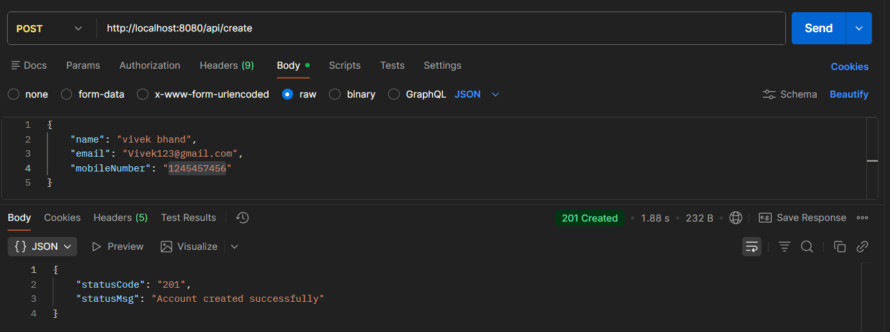
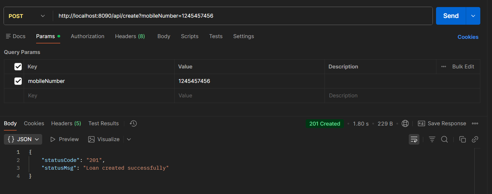
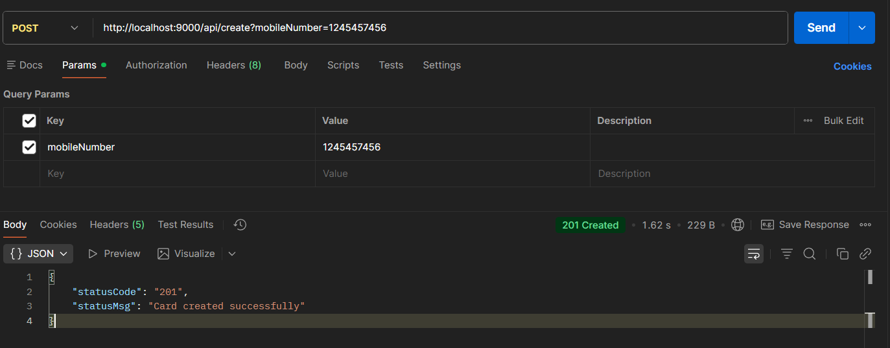

# 🧩 Building Microservices using Spring Boot : EazyBank


---

## 📌 Section Overview

This section focuses on building **core business microservices** using **Spring Boot** following **clean code and layered architecture principles**.  
Each microservice is **independently runnable**, exposes REST APIs, maintains its own database, and acts as a **base layer** for future microservices advancements.

---

## 🏗️ Architecture Style

**Microservices Architecture with Layered MVC Pattern**

- Independent Spring Boot applications
- Controller → Service → Repository separation
- Database per service pattern
- REST-based synchronous communication

---

## 🎯 Aim & Objectives

- Build independent microservices using Spring Boot
- Apply clean layered architecture
- Implement REST APIs with validation & exception handling
- Use DTO pattern for API contracts
- Prepare services for cloud-native evolution

---

## 🧰 Tech Stack Breakdown

| Technology | Purpose |
|---------|--------|
| Java | Core programming language |
| Spring Boot | Microservice development |
| Spring Web | REST API implementation |
| Spring Data JPA | ORM & DB interaction |
| H2 Database | In-memory development DB |
| Spring Validation | Request validation |
| Spring Actuator | Health & metrics |
| Lombok | Boilerplate reduction |
| OpenAPI | API documentation |
| JUnit / Spring Test | Testing |

---

## 🧩 Microservices Involved

| Service | Responsibility |
|------|---------------|
| Accounts Service | Customer & account management |
| Loans Service | Loan information management |
| Cards Service | Card details management |

> All services follow the **same internal code structure**, with domain-specific changes only.

---

## 🔍 Key Structural Highlights

* **DTO Layer:** Decouples internal entities from public API contracts for security and flexibility.
* **Mapper Layer:** Handles the transformation between Database Entities and DTOs (using MapStruct or manual mapping).
* **Global Exception Handling:** Uses `@ControllerAdvice` to provide consistent, user-friendly error responses.
* **Audit Support:** Automated tracking of `createdAt`, `createdBy`, `updatedAt`, and `updatedBy` using Spring Data JPA Auditing.

---

## 🔄 Functional Flow

1.  **Client:** Sends a REST request to the specific service Controller.
2.  **Controller:** Validates input using `@Valid` and constraints.
3.  **Service Layer:** Coordinates business logic and orchestrates data flow.
4.  **Repository:** Uses Spring Data JPA to interact with the H2/SQL database.
5.  **Mapping:** Entities are converted back to DTOs for the response.
6.  **Response:** A standardized JSON payload is returned to the client.

---

## ✨ Key Features & Patterns

- ✅ **RESTful CRUD APIs:** Clean, resource-based URI design.
- ✅ **DTO Pattern:** Prevents leaking database schema to the UI.
- ✅ **Global Exception Handling:** Centralized logic for handling 404s, 500s, etc.
- ✅ **Input Validation:** Strict validation of request bodies.
- ✅ **Audit Columns:** Automatic timestamping for data integrity.
- ✅ **API Documentation:** Integrated Swagger/OpenAPI for interactive testing.
- ✅ **Layered Architecture:** Clear separation of concerns for high testability.

---

## ⚙️ Configuration & Setup

### Environment Details
- **Configuration:** Managed via `application.yml`.
- **Database:** H2 In-memory database (Development) / SQL (Production).
- **Monitoring:** Spring Boot Actuator endpoints enabled.
- **Documentation:** Swagger UI enabled for all services.

### Default Port Mapping
| Service  | Port |
| :--- | :--- |
| **Accounts** | `8080` |
| **Loans** | `8090` |
| **Cards** | `9000` |

---
## ▶️ How to Run Locally

### Prerequisites
* **Java 17+**
* **Maven 3.8+**

### Steps
1.  **Clone the repository:**
    ```bash
    git clone <repository-url>
    ```
2.  **Navigate to a service directory:**
    ```bash
    cd accounts
    ```
3.  **Run the application:**
    ```bash
    mvn spring-boot:run
    ```
> **Note:** Repeat these steps in separate terminals for the **Loans** and **Cards** services.

---

## 📡 API Details (Sample – Accounts)

| Method   | Endpoint                     | Description                                    |
| :------- | :--------------------------- | :--------------------------------------------- |
| `POST`   | `/api/create`                | Create a new bank account                      |
| `GET`    | `/api/fetch?mobileNumber=`   | Retrieve account details by mobile number      |
| `PUT`    | `/api/update`                | Update existing account details                |
| `DELETE` | `/api/delete?mobileNumber=`   | Remove account associated with mobile number   |
| `GET`    | `/api/build-info`            | Fetch current application build version        |
| `GET`    | `/api/java-version`          | Get the JRE version running the service        |
| `GET`    | `/api/contact-info`          | Retrieve support and developer contact details |

---
## 🗄️ Database Access

All services use an in-memory **H2 Database** for development. You can access the web console to view and query data while the service is running.

| Setting          | Value                                      |
| :--------------- | :----------------------------------------- |
| **Console URL** | `http://localhost:<PORT>/h2-console`       |
| **JDBC URL** | `jdbc:h2:mem:testdb`                       |
| **User Name** | `sa`                                       |
| **Password** | *(None/Empty)* |

---

## 📘 Swagger UI Access

Access the interactive documentation to test the APIs directly:

* **Accounts Service:** [http://localhost:8080/swagger-ui.html](http://localhost:8080/swagger-ui.html)
* **Loans Service:** [http://localhost:8090/swagger-ui.html](http://localhost:8090/swagger-ui.html)
* **Cards Service:** [http://localhost:9000/swagger-ui.html](http://localhost:9000/swagger-ui.html)

---

## 🧩 Architecture Benefits

* **Loosely Coupled:** Services function independently with minimal dependencies.
* **Separation of Concerns:** Clear boundaries between Web (Controller), Logic (Service), and Data (Repository) layers.
* **Scalability:** Each service can be scaled independently based on demand.
* **Interview Ready:** Designed using production-grade patterns (Audit, DTO, Exception Handling).

---
## 📸 Service Snapshots

### Accounts Service


---

### Loans Service


---

### Cards Service

